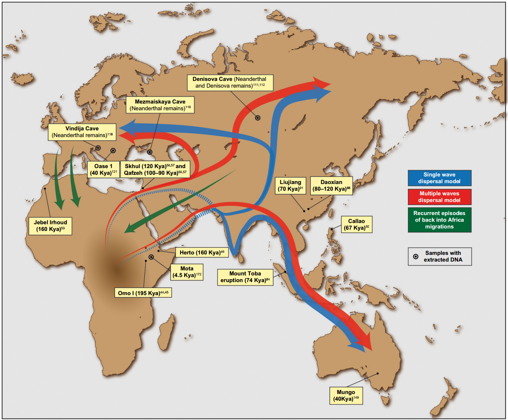

## Summary of the context and overall objectives of the project
After migrating out of Africa, human populations were exposed to a wide range of environmental conditions. One critical factor that differs dramatically among human populations inhabiting different parts of the world is temperature. Over millennia, exposure to varying temperatures could have modified the response to external temperature in these populations. In other words, this exposure could act as a selective pressure, shaping the metabolism of human populations and leading them to adapt to different temperature regimes. For instance, genetic adaptation to cold conditions might occur in a population that migrated to higher latitudes if that population contains genetic variants providing an advantage for coping with cold. In such a scenario, individuals carrying these advantageous variants would experience higher reproductive success, leading to an increased frequency of these cold-beneficial variants (i.e., variants are positively selected). This process leaves detectable signals in the genome, known as signatures of positive selection or adaptation. We can identify these signals using various statistical and machine learning methods. Consequently, the genomes of current populations serve as a record of past selective events experienced by those populations

Saioa López, Lucy van Dorp and Garrett Hellenthal - López, S., van Dorp, L., & Hellenthal, G. (2015). Human Dispersal Out of Africa: A Lasting Debate. Evolutionary Bioinformatics Online, 11(Suppl 2), 57–68. http://doi.org/10.4137/EBO.S33489 https://www.ncbi.nlm.nih.gov/pmc/articles/PMC4844272/, CC BY 3.0, https://commons.wikimedia.org/w/index.php?curid=50508700

